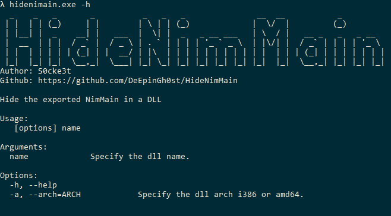
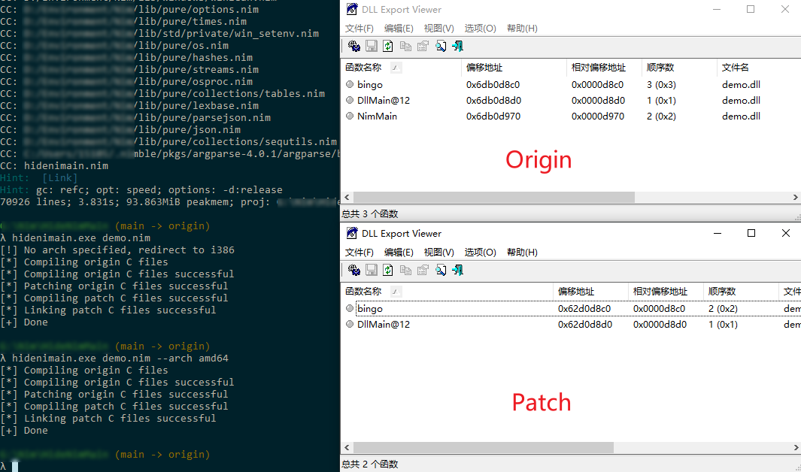

# HideNimMain

HideNimMain是一个用于隐藏使用nim编译dll中NimMain导出函数的实用性工具




## 使用方法/示例

安装依赖库
```
nimble install argparse
```
编译
```
nim c -d:release hidenimain.nim
```
HideNimMain支持编译处理x86和x64架构的dll

**x86**

```
hidenimain.exe demo.nim
```
**x64**

```
hidenimain.exe demo.nim --arch amd64
```
## 截图




## 参考

 - [nim-hide-nimmain-in-dll](https://blog.zweinoch.de/posts/nim-hide-nimmain-in-dll/)

